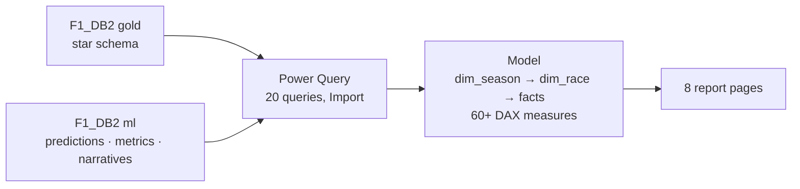

# F1 Race Analytics — Power BI

An interactive Formula 1 report on top of the **[F1 Data Warehouse](https://github.com/Sahil-Patel180/SQL_Projects/tree/main/F1%20Data%20Warehouse)** (SQL Server star schema), with **machine-learning predictions** and **LLM-written race recaps** from **[f1-analytics-ml](https://github.com/Sahil-Patel180/f1-analytics-ml)** shown next to what really happened.

## Pages

| # | Page | What it shows |
| --- | --- | --- |
| 1 | Season Overview | Champion (or leader), title-fight line chart, wins and constructors' points |
| 2 | Driver Profile | Career and season stats, finish distribution, retirement reasons, LLM season summary |
| 3 | Constructor Profile | Points per season, reliability, driver contribution, pit-crew speed |
| 4 | Race Detail | Classification, lap chart, grid vs finish, pit stops, LLM race recap |
| 5 | Circuits | Map, overtaking (positions gained) and pit-stop counts per circuit |
| 6 | Predictions vs Actual | Podium probability vs result, top-3 pick hit rate, calibration |
| 7 | Model Performance | Every model vs its baseline on the 2023–2024 test seasons |
| 8 | About | Sources, architecture, links |

Full visual-by-visual spec: [report_pages.md](report_pages.md).

## Files

| File | Purpose |
| --- | --- |
| `model/power_query.m` | The 20 Power Query queries (2 parameters: `ServerName`, `DatabaseName`) |
| `model/relationships.md` | The 30 relationships, model settings, why `dim_season` exists |
| `measures.dax` | 60+ measures, pasted in one go through DAX query view |
| `theme_f1.json` | Report theme (F1 red / carbon) |
| `report_pages.md` | Page layouts: every visual and its fields |
| `images/` | Page screenshots |
| `f1_race_analytics.pbix` | The finished report (added after building) |

## Build it

Prerequisites: the warehouse loaded in SQL Server (`F1_DB2`), `python -m f1ml.train --write-back` and the `f1ml.llm.narrate` commands run once (the ml tables can also be empty; those visuals then stay blank), Power BI Desktop (2024 or later, for DAX query view).

1. **New report** → File > Options > Current file > Data load: untick *Autodetect new relationships*.
2. **Parameters**: Transform data > Manage parameters > New: `ServerName` = your SSMS server (e.g. `SAHIL\SQLEXPRESS`), `DatabaseName` = `F1_DB2`.
3. **Queries**: for each block in `model/power_query.m`, New Source > Blank query > Advanced editor > paste, then rename the query to the name in its header. Close & Apply (Import mode; Windows credentials when asked).
4. **Relationships**: Model view, create the 30 in `model/relationships.md`; apply the model settings table below it.
5. **Measures**: Home > Enter data > table `_Measures` > Load. Open DAX query view, paste `measures.dax`, click **Update model with changes**, then run it (F5) to check every measure evaluates.
6. **Theme**: View > Themes > Browse for themes > `theme_f1.json`.
7. **Pages**: build the 8 pages from `report_pages.md`.
8. **Check the numbers**: on Season Overview pick 2024; the champion card must show the same name and points as `SELECT * FROM gold.agg_driver_season WHERE season_year = 2024 AND is_champion = 1` in SSMS.
9. Save as `f1_race_analytics.pbix` in this folder, add screenshots to `images/`, commit.

### If something goes wrong

| Symptom | Cause | Fix |
| --- | --- | --- |
| "Update model with changes" missing | Older Power BI Desktop | Update Desktop, or add measures one by one (New measure, paste the text after `MEASURE _Measures[Name] =`) |
| Measure error "cannot find table" | A query has a different name | Rename the query to exactly the name in `power_query.m` |
| Season slicer does not filter driver summaries | Relationship 2 or 3 missing | Add `dim_season` → `agg_driver_season` / `narr_driver_season` |
| Championship points far too high | A visual sums `championship_points` directly | Use the `[Championship Points]` measure (standings are snapshots) |
| Predictions page empty | ml tables empty | Run `python -m f1ml.train --write-back` in f1-analytics-ml, then Refresh |

## Model design notes

- **Star schema, single-direction filters.** Dimensions filter facts; no bidirectional relationships, so no ambiguous filter paths.
- **`dim_season` above `dim_race`.** One season slicer reaches race facts and season-level tables (`agg_driver_season`, driver summaries).
- **Standings are snapshots.** `[Championship Points]` takes each season's latest round in context instead of summing rounds; summing would count the same points 20+ times.
- **Predictions de-duplicated in Power Query.** Only the latest run per model and version is loaded, so re-training never doubles numbers.
- **Model metrics unpacked from JSON** (`ml.model_runs.metrics_json`) into one row per model × metric with a `beats_baseline` flag.

## Data notes

Qualifying data from 1994, pit stops from 1994, lap times from 1996, sprints from 2021. Pre-1994 pole counts use grid position 1 (in `agg_driver_season`). Predictions exist for the test seasons (2023–2024) and the current season's completed races.
